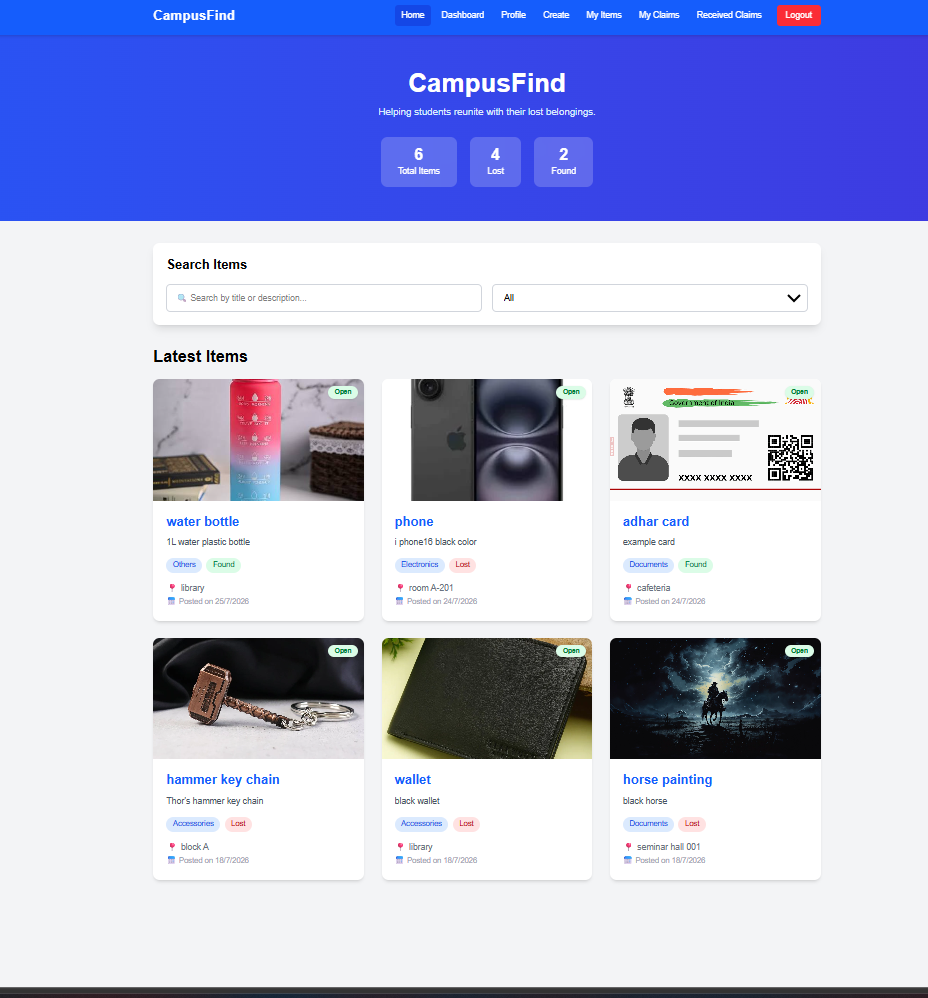
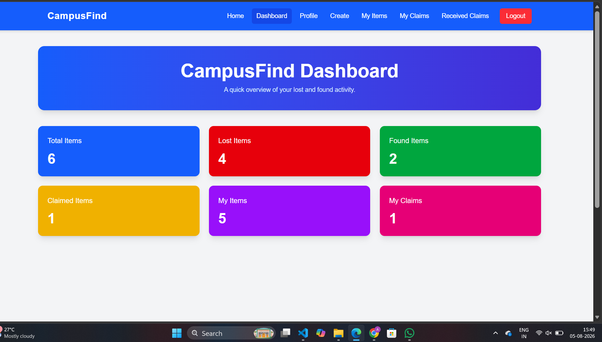
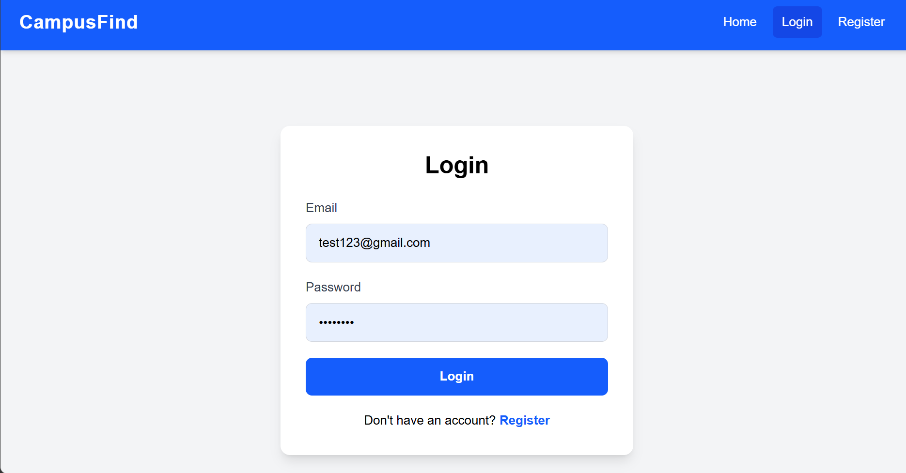
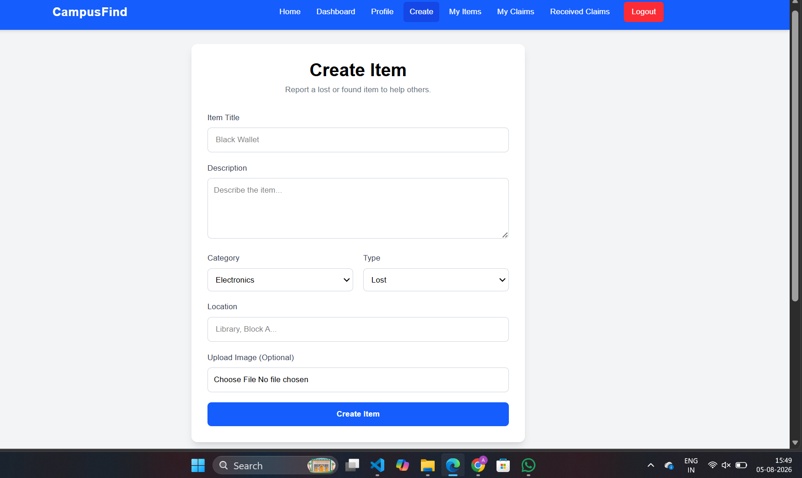
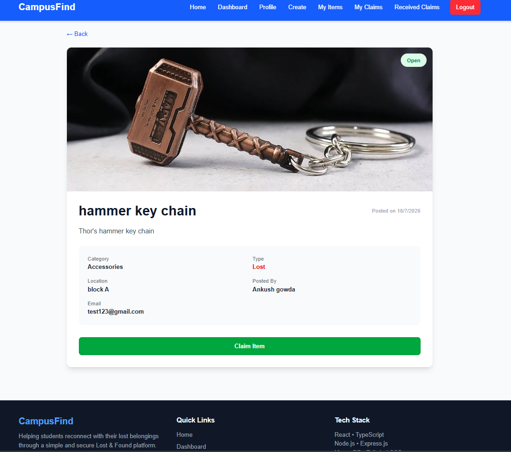
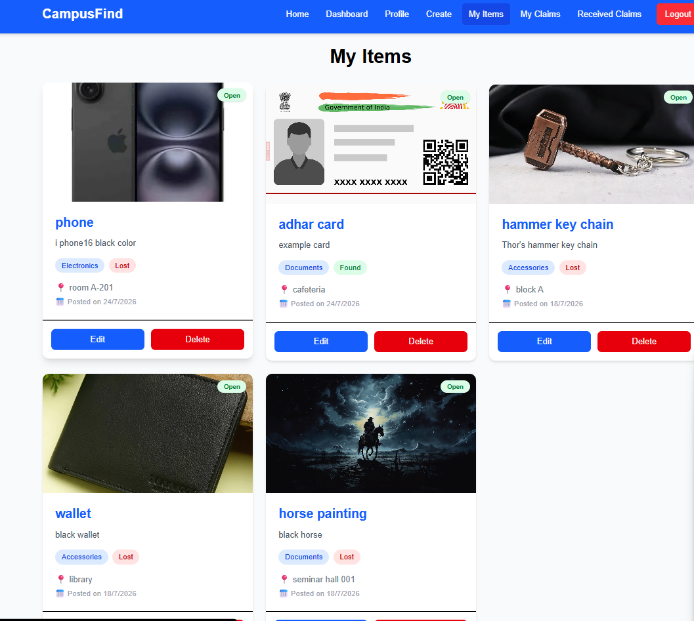
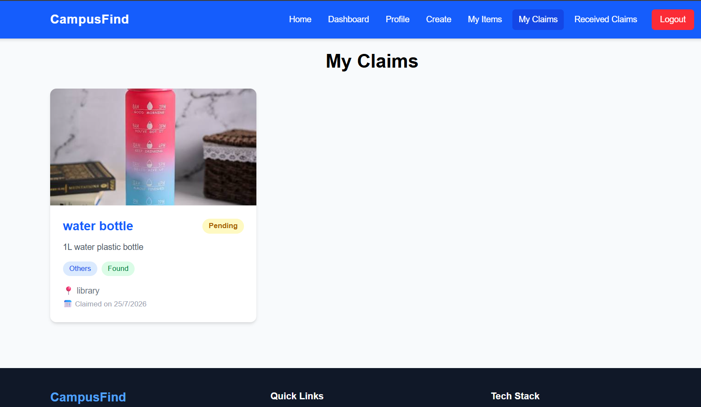

# 🎓 CampusFind – Lost & Found Management System

CampusFind is a full-stack Lost & Found Management System that helps students report, search, and claim lost or found items within a college campus.

## 🚀 Live Demo

https://campus-find-pink.vercel.app

## 📂 GitHub Repository

https://github.com/ankushd-design/CampusFind

---

## ✨ Features

- User Registration & Login
- Secure JWT Authentication
- Protected Routes
- Create Lost Items
- Create Found Items
- Upload Images
- Search Items
- Category Filtering
- View Item Details
- Claim Lost/Found Items
- Accept or Reject Claims
- Dashboard with Statistics
- Profile Management
- Change Password
- Responsive Design
- Cloud Deployment

---

## 🛠️ Tech Stack

### Frontend
- React.js
- TypeScript
- Tailwind CSS
- Axios
- React Router DOM

### Backend
- Node.js
- Express.js
- JWT Authentication
- Multer

### Database
- MongoDB Atlas

### Deployment
- Vercel
- Render

---

## 📸 Screenshots

### 🏠 Home Page


### 📊 Dashboard


### 🔐 Login


### ➕ Create Item


### 📄 Item Details


### 👤 Profile


### 📦 My Items


### 📨 My Claims

## 📁 Project Structure

```
CampusFind/
│
├── client/
│   ├── src/
│   ├── public/
│   └── package.json
│
├── server/
│   ├── controllers/
│   ├── middleware/
│   ├── models/
│   ├── routes/
│   ├── uploads/
│   └── server.js
│
├── README.md
└── .gitignore
```

---

## ⚙️ Installation

### Clone the Repository

```bash
git clone https://github.com/ankushd-design/CampusFind.git
```

### Frontend

```bash
cd client
npm install
npm run dev
```

### Backend

```bash
cd server
npm install
npm run dev
```

---

## 👨‍💻 Author

**Ankush D**

GitHub: https://github.com/ankushd-design

LinkedIn: YOUR-LINKEDIN-URL

---

## 📄 License

This project is created for educational and academic purposes.